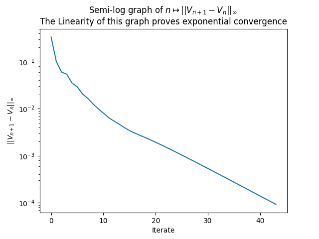

# REPORT Reinforcement Learning      
## TD 1 - MDP       

### EXERCICE 1

#### **Q2- Describe the MDP associated to this environment and formalize mathematically the goal of an agent.**
The environment has 16 potential states and 4 actions. 
The states are composed of : starting cell S, frozen cells (F) for safe states, a hole (H) that should be avoided, and the goal cell G that should be reached.
The agent must learn how to reach G from S while avoiding H.
For a given action for a given state the agent has a probability of 1/3 to access the desired state.    

#### **Q5- Compare the result of this question with the Monte-Carlo estimation of the previous question and check for consistency.**
There is a global consistency between both methods. However, the linear system method is more efficient, 86 000 times faster !
Indeed on my computer the results from both methods are the following : 

- Monte Carlo method
Running time: 60.1899 sec

Value estimate of the starting point: 0.013     
Value function of the always RIGHT policy:

0.0128  0.0117  0.0278  0.0    
0.0189  0.0     0.0646  0.0    
0.0492  0.147   0.186   0.0    
0.0     0.301   0.557   0.0    

- Linear System method
Running time: 0.0007 sec

Value estimate of the starting point: 0.013      
Value function of the always RIGHT policy:

0.0131  0.0118  0.0274  1.15e-16
0.0188  1.1e-16 0.064   1.54e-16
0.0494  0.146   0.186   0.0
0.0     0.301   0.556   0.0

#### **Q6- What could be a good stopping criterion for your algorithm?**
The algorithm must stop when there is no more improvement. A good stopping criterion is therefore a very smaller number (which is compared to the difference of the absolute difference between the two value-functions from the 2 last iterations).

#### **Q7 -**    
In the previous question we filled the Pi-function according to the pi policy and then we updated the value function.
Now to get the optimal function without following a particular policy : at each state each action must be considered. 
I created a find_best_action function to get at a given state the best action to consider.

#### **Q8-**

#### **Q9- Compare the two methods**
The value iteration and policy iteration methods give the same policy functions. The difference is in the running time : the policy iteration method is more efficient. 

- Value iteration algorithm   
Running time: 0.0164 sec

An optimal policy is:

←↑←↑   
←←←←    
↑↓←←    
←→↓←    

- Policy iteration algorithm   
Running time: 0.0050 sec

An optimal policy is:
  
←↑←↑   
←←←←    
↑↓←←    
←→↓←    

#### **Q-10 : 13**
refer to the .py